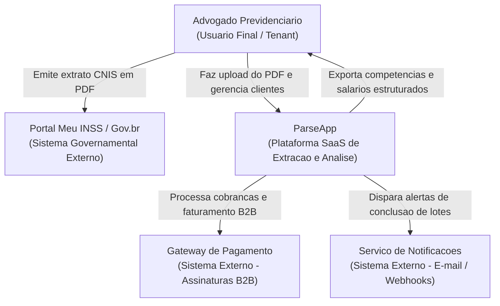
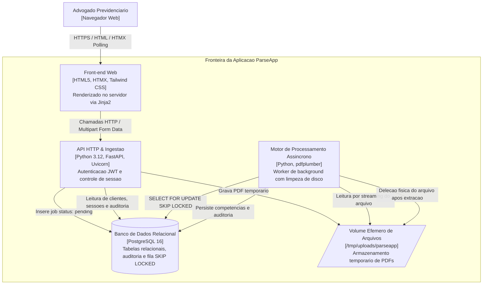

# Modelagem Arquitetural - C4 Model (Niveis 1 e 2)

Este documento descreve a arquitetura do sistema **ParseApp** utilizando o modelo C4 (Contexto e Conteineres), mapeando as fronteiras de software, os usuarios e as integracoes com servicos externos.

---

## C4 Nivel 1 - Diagrama de Contexto de Sistema

O diagrama de contexto ilustra como o ParseApp se posiciona no ecossistema de software de um escritorio de advocacia previdenciaria, incluindo os usuarios finais e as integracoes externas:

### Elementos do Nivel 1

| Elemento | Tipo | Descricao |
| :--- | :--- | :--- |
| **Advogado Previdenciario** | Pessoa | Advogado ou operador de escritorio juridico que necessita extrair historicos contributivos para instruir calculos de aposentadoria ou revisoes. |
| **Portal Meu INSS / Gov.br** | Sistema Externo | Plataforma governamental oficial de onde o advogado ou segurado faz o download do extrato CNIS autenticado em formato PDF. |
| **ParseApp** | Sistema de Software | A solucao SaaS central responsavel pela ingestao, desestruturacao, validacao de dados e fornecimento da interface e APIs. |
| **Gateway de Pagamento** | Sistema Externo | Provedor de pagamentos recorrentes responsavel pela gestao de assinaturas dos escritorios clientes. |
| **Servico de Notificacoes** | Sistema Externo | Infraestrutura de mensageria para envio de relatorios consolidados e alertas de operacoes concluidas. |

---

## C4 Nivel 2 - Diagrama de Conteineres

O diagrama de conteineres detalha as aplicacoes, servicos e bancos de dados que compõem o ParseApp, bem como os protocolos de comunicacao empregados:

### Detalhamento dos Conteineres

| Conteiner | Tecnologia | Responsabilidade |
| :--- | :--- | :--- |
| **Front-end Web** | HTML5, HTMX, Tailwind CSS, Jinja2 | Interface reativa orientada a hipermidia (HDA). Permite o gerenciamento de clientes, o envio de arquivos por dropzone interativa e o acompanhamento de progresso com polling assincrono a cada 1s. |
| **API HTTP & Ingestao** | FastAPI, Uvicorn, Python 3.12 | Gateway da aplicacao. Valida credenciais JWT, efetua o upload streaming de arquivos para o disco efemero, enfileira jobs com status `pending` e disponibiliza endpoints REST JSON e fragmentos HTML. |
| **Motor de Processamento** | Python 3.12, pdfplumber | Worker assincrono responsavel pelo consumo ordenado da fila, abertura segura de PDFs, varredura de linhas de texto, extracao de competencias `MM/AAAA` e exclusao obrigatoria do arquivo no bloco `finally:`. |
| **Banco de Dados Relacional** | PostgreSQL 16 | Armazenamento persistente de escritorios (`advogados`), titulares (`clientes`), historicos contributivos (`contribuicoes`), auditoria (`extractions_logs`) e gestao da fila transacional (`extraction_jobs`). |
| **Volume Efemero de Arquivos** | Sistema de Arquivos / tmpfs (`/tmp/uploads/parseapp`) | Armazenamento estritamente efemero para os PDFs durante o periodo de processamento, evitando alocacao pesada de binarios na memoria RAM dos workers web. |
