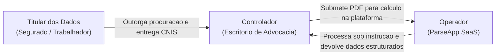

# Mapeamento e Conformidade com a LGPD (Lei 13.709/2018)

Este documento estabelece a fundamentacao juridico-tecnica do tratamento de dados pessoais no **ParseApp**, detalhando os papeis dos agentes de tratamento, as categorias de dados manipuladas, as bases legais aplicaveis e as salvaguardas tecnicas implementadas em conformidade com o **Artigo 11 da Lei Geral de Protecao de Dados Pessoais (LGPD)**.

---

## 1. Papeis dos Agentes de Tratamento

Na operacao do ParseApp, as responsabilidades legais estao estritamente delimitadas:

- **Titular dos Dados:** O trabalhador ou segurado da Previdencia Social, pessoa natural a quem se referem os dados cadastrais, vinculos de emprego e remuneracoes contidas no extrato CNIS.
- **Controlador:** O **Escritorio de Advocacia ou Advogado Autonomo**. E o agente a quem competem as decisoes referentes ao tratamento dos dados pessoais de seus clientes, incluindo a coleta do documento perante o INSS, a definicao da tese juridica e a propositura da acao previdenciaria.
- **Operador:** O **ParseApp**. A plataforma atua estritamente como operadora de software sob demanda, realizando o processamento tecnico (extracao, estruturacao e armazenamento tabular) exclusivamente sob a determinacao e em nome do Controlador.

---

## 2. Categorias de Dados Tratados e Impacto

O extrato CNIS reune informacoes de profunda intimidade sobre a vida laboral e financeira do cidadao:

| Categoria | Campos Especificos | Nivel de Sensibilidade | Justificativa de Uso |
| :--- | :--- | :---: | :--- |
| **Identificacao Pessoal** | Nome completo, CPF, NIT/PIS, data de nascimento. | Alto | Vinculacao juridica do segurado ao calculo processual. |
| **Historico Ocupacional** | Nomes de empregadores, CNPJ/CEI, datas de admissao e demissao, tipo de filiacao. | Medio / Alto | Determinacao do tempo de contribuicao e carencia. |
| **Dados Financeiros / Salariais** | Remuneracoes mensais historicas, salarios de contribuicao. | Alto | Base de calculo da Renda Mensal Inicial (RMI). |
| **Indicativos Previdenciarios** | Indicadores de recolhimento em atraso, pendencias e auxilios de saude (auxilio-doenca, aposentadoria por incapacidade permanente). | Sensivel (Art. 11 LGPD) | Identificacao de periodos de incapacidade laboral e necessidade de comprovacao pericial. |

---

## 3. Finalidade e Bases Legais Aplicaveis

O tratamento de dados realizado por meio do ParseApp fundamenta-se nas seguintes hipoteses legais da Lei 13.709/2018:

### 3.1 Base Legal do Controlador (Escritorio de Advocacia)
- **Exercicio Regular de Direitos em Processo Judicial ou Administrativo (Art. 7º, VI e Art. 11, II, "d"):**
  A analise do CNIS e etapa obrigatoria para instruir peticoes de concessao de beneficios, revisoes de aposentadoria e mandados de seguranca perante o INSS e a Justica Federal.
- **Execucao de Contrato de Prestacao de Servicos Juridicos (Art. 7º, V):**
  O segurado contrata o profissional do direito expressamente para avaliar e promover seus direitos previdenciarios.

### 3.2 Escopo de Atuacao do Operador (ParseApp)
O ParseApp nao utiliza os dados pessoais ou salariais dos segurados para qualquer finalidade comercial propria, treinamento de modelos publicos, enriquecimento de bases ou compartilhamento com terceiros. A utilizacao e adstrita ao cumprimento das instrucoes do Controlador para a entrega do calculo contratado.

---

## 4. Medidas Tecnicas e Salvaguardas de Seguranca

Para proteger os dados e mitigar riscos de vazamento ou acesso nao autorizado, a aplicacao implementa as seguintes garantias de engenharia de software:

### 4.1 Principio da Minimizacao e Armazenamento Efemero
- O ParseApp nao mantem um repositorio definitivo de arquivos PDF.
- O arquivo original do CNIS e gravado temporariamente em volume efemero (`/tmp/uploads/parseapp/`) unicamente pelo tempo necessario para que o worker execute a leitura dos caracteres.
- A exclusao fisica do PDF (`os.unlink`) e executada de maneira deterministica no bloco `finally:` de cada tarefa, impedindo que o documento original permaneca acessivel no disco mesmo em caso de erro na extracao.

### 4.2 Isolamento Logico Multi-Tenant
- Todo acesso aos registros gravados no banco de dados (`clientes`, `contribuicoes`, `extractions_logs`, `extraction_jobs`) e estritamente restrito atraves do identificador do advogado autenticado (`advogado_id`).
- Um escritorio nao possui meios tecnicos de consultar, alterar ou visualizar o historico contributivo de clientes atendidos por outro escritorio. Tentativas de acesso indevido por ID direto resultam em retorno HTTP 404 imediato.

### 4.3 Sanitizacao de Logs e Observabilidade
- Registros de log da aplicacao (`_LOGGER.info` / `_LOGGER.error`) e a tabela de auditoria `extractions_logs` gravam apenas o nome do arquivo, carimbos de data/hora e o status de sucesso/falha tecnica do processador.
- E proibida a inclusao de CPFs, valores de salarios ou dados cadastrais de segurados em mensagens de log que possam ser visualizadas por desenvolvedores ou ferramentas de monitoramento.

### 4.4 Ambientes de Testes com Dados Sinteticos
- Toda a bateria de testes automatizados (`tests/`) e executada em bancos SQLite em memoria e fixtures isoladas, utilizando exclusivamente massas de dados ficticias (nomes gerados sinteticamente e CPFs de teste sem correspondencia com pessoas reais).
